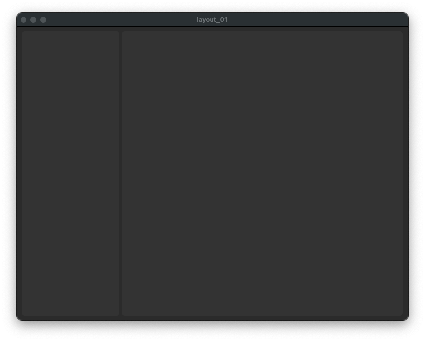
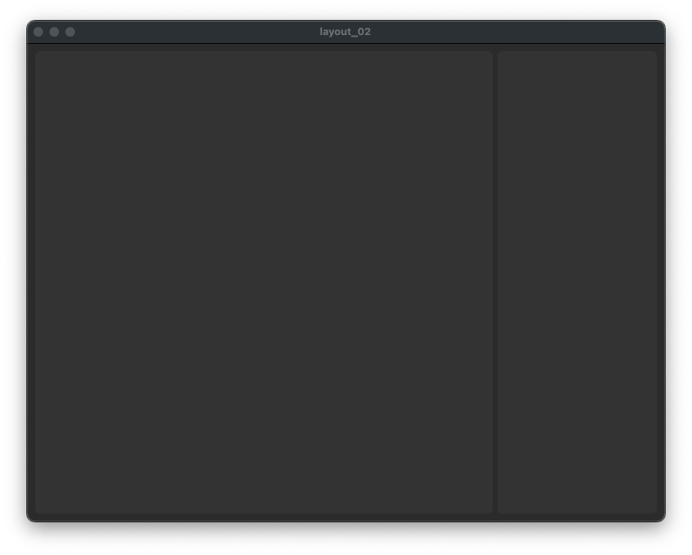
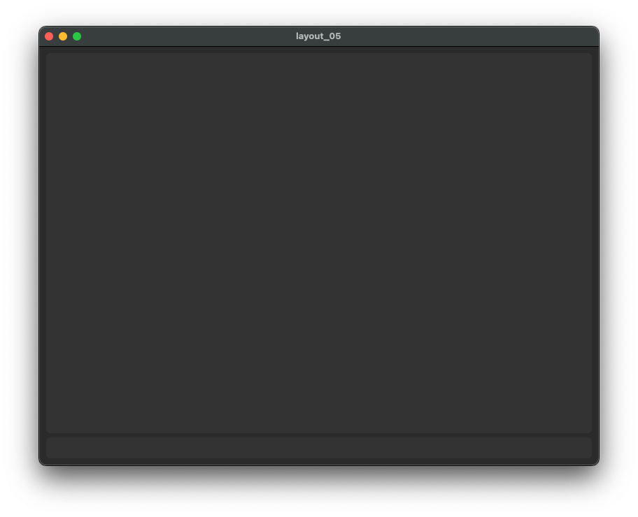
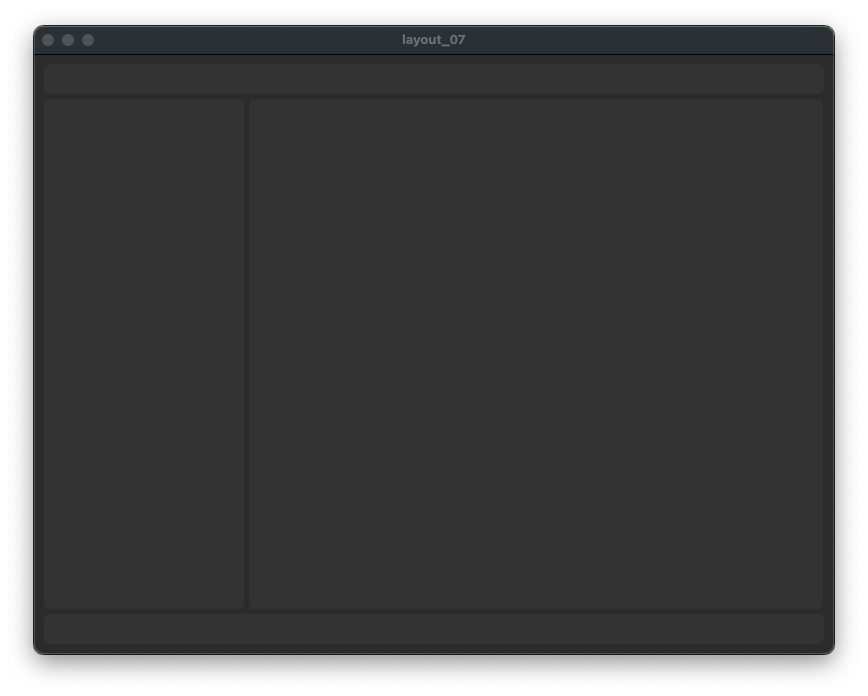
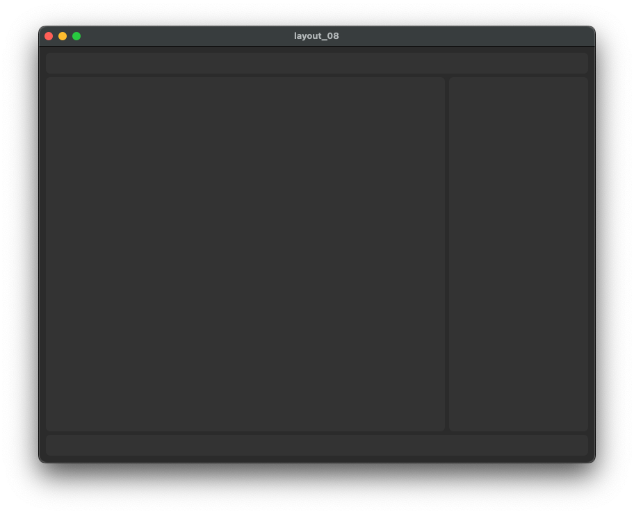
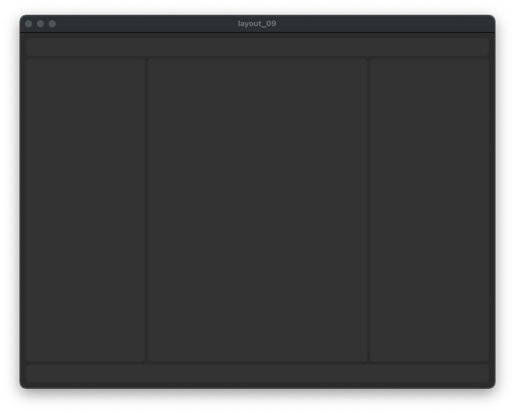

# A layout manager for customtkinter.

Rather than spending time doing boiler plate code to create frame layouts 
this class will create a number of basic layouts.

# Installation

`pip install git+ssh://git@github.com/Barrowcroft/layout_manager.git`

or

`uv add git+https://git@github.com/barrowcroft/layout_manager.git`

# Usage

Choose a layout, create it and add to current frame.

```
from layout_manager import LayoutManager

self._layout_manager: LayoutManager = LayoutManager()

self._layout = self._layout_manager.create_layout(
    self, layout="layout_00", padx=10, pady=10, gutter=5
)

self._layout.grid(row=0, column=0, padx=0, pady=0, sticky="nsew")
```

The created frames are simply named as: left, middle, right, top, bottom.

# Example layouts

layout_01

layout_02

layout_03

layout_04

layout_05

layout_06

layout_07

layout_08

layout_09
